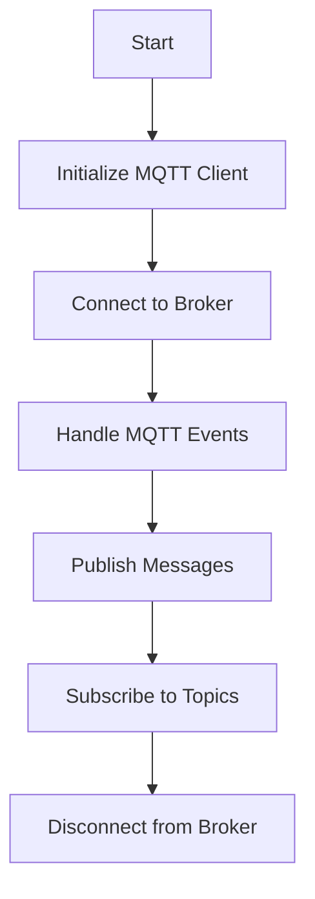

# MQTT 5 API

## Overview
The MQTT 5 API module provides functionalities to connect, publish, and subscribe to MQTT topics using the MQTT v5 protocol. It handles various MQTT events and supports advanced features like user properties and subscription options.

## How It Works


## Workflow Description
1. **Initialize MQTT Client**: Configure the MQTT client with broker details, user credentials, and protocol-specific properties.
2. **Connect to Broker**: Establish a connection to the specified MQTT broker.
3. **Handle MQTT Events**: Manage events such as connection, disconnection, message reception, and errors.
4. **Publish Messages:** Send messages to specific MQTT topics using configurable properties.
5. **Subscribe to Topics**: Subscribe to topics with advanced subscription options.
6. **Disconnect from Broker**: Clean up resources and disconnect from the broker.

## External Dependencies
- **ESP-IDF**: Provides the necessary libraries and tools for ESP32 development.
- **FreeRTOS**: Used for task management and synchronization.
- **MQTT Client**: Provides the MQTT client functionalities.
- **ISP Connection**: Requires a network connection via Wi-Fi, Ethernet, or cellular.

## How to Use
- Include the MQTT 5 API module in your project by adding it to your CMakeLists.txt:
```cmake
idf_component_register(SRCS "mqtt5_api.c"
                    INCLUDE_DIRS "include"
                    REQUIRES mqtt5_api)
```

## Configuration Details
- **Broker URL**: The URL of the MQTT broker.
- **Username**: The username for MQTT authentication.
- **Password**: The password for MQTT authentication.
- **Port**: The port for MQTT connection (1883 for MQTT, 8883 for MQTT over SSL).
- **Advanced Properties**: Configure properties like user properties and subscription options through mqtt5_properties.h.

## Future Implementations
1. Logs can be adjusted or removed for use in interrupt contexts to optimize performance.
2. Ensure that the MQTT broker supports MQTT 5.0 for advanced features.
3. Add dynamic topic alias management.
4. Implement an example for shared subscriptions.

## References
- [ESP-IDF MQTT API](https://docs.espressif.com/projects/esp-idf/en/v5.3.1/esp32/api-reference/protocols/mqtt.html)
- [MQTT 5.0 Example](https://github.com/espressif/esp-idf/tree/master/examples/protocols/mqtt5)
